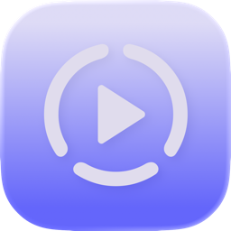

<div align="center">
  

  # Maya for Linux (Studio Pro)

  **Wrap screen recordings in polished device mockups, customize pacing, apply 3D gyro tilt angles, animate cinematic zooms, place interactive tap ripples, add YouTube/MP3 background music, and export ready-to-share video clips.**

  *A high-performance Linux desktop application for creators, developers, and marketers.*

  [](https://github.com/)
  [](https://github.com/)
  [](LICENSE)
</div>

---

## ⬇️ Download & Quick Run (AppImage)

Maya runs on **Ubuntu, Debian, Fedora, Arch, Pop!_OS, openSUSE, Manjaro**, and any modern Linux distribution with **zero extra setup**.

```bash
# 1. Download the latest AppImage release
# 2. Make it executable:
chmod +x Maya-1.1.0.AppImage

# 3. Run:
./Maya-1.1.0.AppImage
```

---

## ✨ Features

### 📱 Device Framing & Mockups
- **iPhone 17 Pro**: Cosmic Orange, Deep Blue, Silver.
- **iPhone 16 Pro**: Natural Titanium, Black Titanium, White Titanium, Desert Titanium.
- **iPhone 15 Pro**: Natural Titanium, Black Titanium, White Titanium.
- **iPad Pro 11"** (Landscape M4) & **MacBook Pro 14"** with pixel-accurate screen cutouts and rounded mask corners.
- **Generic Phone Mode**: Brand-agnostic device frame with configurable **bezel width**, **bezel color**, and **corner radius**.
- **No-Frame Mode**: Ship clean recordings with custom rounded corners only.
- **Canvas Aspect Ratios**: **1:1** (Square), **9:16** (Reels / Shorts / TikTok), **4:5** (Portrait), **4:3** (Landscape), **16:9** (YouTube / Widescreen).
- **Photorealistic Drop Shadows**: Blur radius, X/Y offset, and opacity controls.

### 📐 3D Perspective, Pitch & Yaw (Keynote Mode)
- **3D Tilt & Rotation**: Adjust Pitch (`rotateX`), Yaw (`rotateY`), and Roll (`rotateZ`) in real time.
- **1-Click Isometric Presets**: *Isometric Left*, *Isometric Right*, and *Flat / Reset*.
- **Cinematic Parallax Drift**: Subtle auto-drift motion around the device during playback.

### ⏱ Multi-Track Timeline & Animation System
- **Zooms Track**: 6 easing curves (*Spring*, *Bouncy*, *Smooth*, *Snappy*, *Gentle*, *Linear*) with *Top, Center, Bottom* focus anchors.
- **Taps Track**: Interactive *Ripple*, *Pulse*, and *Ring* feedback animations positioned anywhere on the screen with built-in **SFX click audio**.
- **Callouts Track**: Feature badges (*Pill*, *Frosted Glass*, *Neon Glow*) with custom text, font size, and timing.
- **Speed Segments Track**: Non-destructive piecewise retiming from **0.25× to 4×**.
- **Non-Destructive Trimming**: Mark In (<kbd>I</kbd>) and Out (<kbd>O</kbd>) points on the recording.

### 🎵 Background Audio & YouTube (`yt-dlp`) Downloader
- **Direct YouTube Audio Extraction**: Paste any YouTube video URL to automatically extract and attach the audio track using `yt-dlp`.
- **Custom Audio Upload**: Import local **MP3, WAV, AAC, or OGG** files.
- **Audio Controls**: Individual timeline volume slider and synchronized playback.

### 🎨 Backgrounds & Branding
- **8 Curated Gradients**: Brand-aligned Maya presets (`#6466FA`).
- **Solid Colors**: Brand palette + custom hex picker.
- **Video Blur Backdrop**: Blurred Keynote-style dynamic poster of your screen recording.
- **Transparent (Alpha)**: Exports transparent video for overlaying onto other video tracks in OBS, DaVinci Resolve, or Kdenlive.

### 💾 Saved Projects (`.mayaproj`)
- Save complete layouts, animation keyframes, callouts, and audio timelines to `.mayaproj` JSON files to easily reopen and edit past projects.

---

## ⌨️ Keyboard Shortcuts

| Key | Action |
|---|---|
| <kbd>Space</kbd> | Play / Pause |
| <kbd>M</kbd> | Mute / Unmute |
| <kbd>Delete</kbd> / <kbd>Backspace</kbd> | Delete selected Zoom, Tap, Callout, Audio, or Speed block |

---

## 🛠 Tech Stack

- **Desktop Framework**: Electron + TypeScript
- **UI Engine**: React 19 + Tailwind CSS + Framer Motion + Lucide Icons
- **Compositing**: High-performance HTML5 Canvas 2D / WebGL real-time frame renderer
- **Audio Extraction**: `yt-dlp`
- **Packaging**: `electron-builder` (`AppImage`, `.deb`, `.tar.gz`)

---

## 📦 Building from Source

### Prerequisites
Make sure you have Node.js (v18+) and npm installed:

```bash
# Clone the repository
git clone https://github.com/YOUR_USERNAME/maya-linux.git
cd maya-linux

# Install dependencies
npm install

# Run in Development Mode
npm run dev

# Or Launch Desktop Electron App in Dev Mode
npm run app:dev
```

### Create the AppImage Package
```bash
npm run dist
```
The resulting portable `.AppImage` will be generated in `release/Maya-1.1.0.AppImage`.

---

## 🤝 License

Distributed under the [MIT License](LICENSE).
